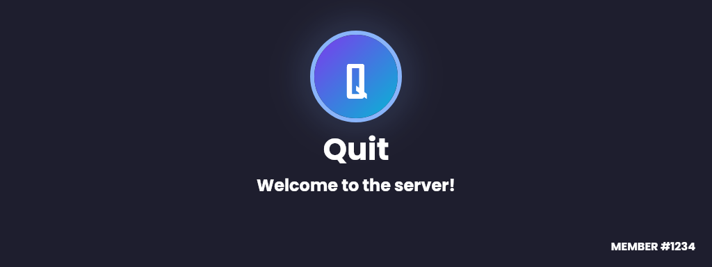
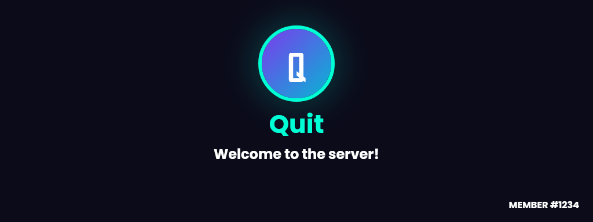
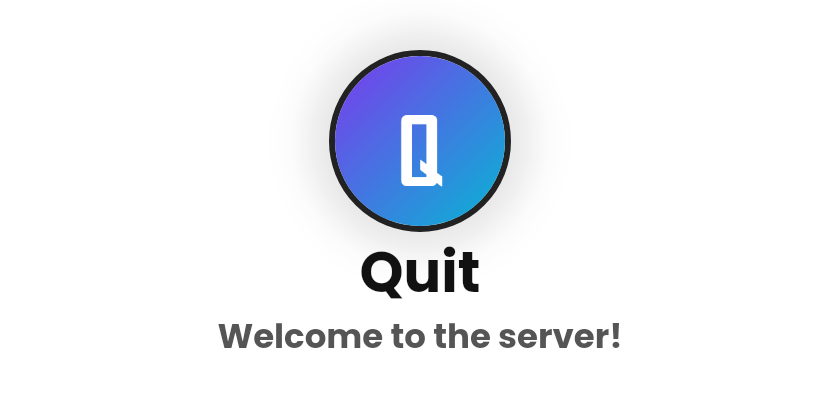
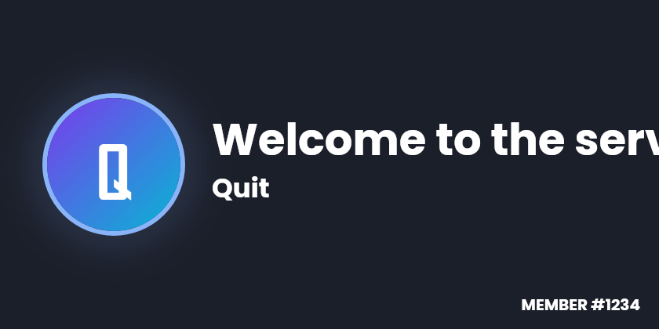

# @quitscope/discord-welcomecard

Render Discord welcome cards as static **PNG** or animated **GIF** from one builder.



- **One API, two outputs** — the same builder renders `.toPNG()` and `.toGIF()`.
- **Animated GIFs** — background sheen, text fade-in, avatar glow/bounce, rainbow ring, slide-in. Autoplays in Discord.
- **No compile pain** — built on `@napi-rs/canvas` (prebuilt binaries, no node-gyp).
- **Bundled font** — cards look the same on every server.
- **TypeScript** — full types, ESM + CJS.

## Install

```bash
npm install @quitscope/discord-welcomecard
```

## Usage

```ts
import { WelcomeCard } from '@quitscope/discord-welcomecard';
import { toAttachment } from '@quitscope/discord-welcomecard/discord';

const card = new WelcomeCard()
  .setPreset('centered')
  .setUsername('Quit')
  .setAvatar('https://cdn.discordapp.com/avatars/.../avatar.png')
  .setSubtitle('Welcome to the server!')
  .setMemberCount(1234)
  .setTheme('dark')
  .setAnimations(['background', 'text', 'avatar']);

const png = await card.toPNG();
const gif = await card.toGIF();

// discord.js
channel.send({ files: [toAttachment(gif, 'welcome.gif')] });
```

### With discord.js events

```ts
client.on('guildMemberAdd', async (member) => {
  const gif = await new WelcomeCard()
    .setUsername(member.user.displayName)
    .setAvatar(member.user.displayAvatarURL({ extension: 'png', size: 256 }))
    .setSubtitle(`Welcome to ${member.guild.name}!`)
    .setMemberCount(member.guild.memberCount)
    .setAnimations(['text', 'avatar'])
    .toGIF();

  const channel = member.guild.systemChannel;
  channel?.send({ files: [toAttachment(gif, 'welcome.gif')] });
});
```

## Presets

| `centered` (default) | `neon` |
| --- | --- |
|  |  |

| `minimal` | `hero` |
| --- | --- |
|  |  |

## Animated

`setAnimations([...])` + `toGIF()` — combine any of the 6 animation types:

| Type | Effect |
| --- | --- |
| `'background'` | Diagonal sheen sweeps across the card |
| `'text'` | Text fades in (ease-out reveal) |
| `'avatar'` | Avatar ring pulses with a glow |
| `'ring'` | Ring color cycles through the full color wheel |
| `'slide'` | Text slides up into position from below |
| `'bounce'` | Avatar bounces up and down |


## API

| Method | Description |
| --- | --- |
| `setPreset(name)` | `'centered'` (default), `'neon'`, `'minimal'`, `'hero'` |
| `setUsername(name)` | Main text (required) |
| `setAvatar(urlOrBuffer)` | Avatar image; falls back to a colored circle if it fails to load |
| `setSubtitle(text)` | Secondary line, e.g. "Welcome to the server!" |
| `setMemberCount(n)` | Renders "MEMBER #n" — optional, omit to hide |
| `setMemberCountPosition(pos)` | 3×3 grid: `'top-left'`, `'top-center'`, `'top-right'`, `'center-left'`, `'center'`, `'center-right'`, `'bottom-left'`, `'bottom-center'`, `'bottom-right'`. `'corner'` is an alias for `'bottom-right'`. Defaults: `'bottom-center'` in the centered presets, `'bottom-right'` in `hero`. |
| `setBackground(value)` | Hex color (`#1e1e2e`), static image URL, or `Buffer` (GIF files are not animated) |
| `setRingColor(hex)` | Override the avatar ring / glow color |
| `setTheme(theme)` | `'dark'` (default) or `'light'` |
| `setFont({ family, color, usernameColor, size, subtitleSize })` | Override font settings; `usernameColor` applies only to the username line |
| `setAnimations(list)` | Any of `'background'`, `'text'`, `'avatar'`, `'ring'`, `'slide'`, `'bounce'` — used by `toGIF()` |
| `toPNG()` | `Promise<Buffer>` — static card |
| `toGIF()` | `Promise<Buffer>` — animated card |

The `toAttachment(buffer, name?)` helper lives in `@quitscope/discord-welcomecard/discord` and requires
`discord.js` (optional peer dependency). The core package works without it.

Only `setUsername()` is required — everything else has sensible defaults or fallbacks.

## Requirements

- Node.js ≥ 18

## License

MIT. Font: [Poppins](https://fonts.google.com/specimen/Poppins) (SIL Open Font License, bundled).
